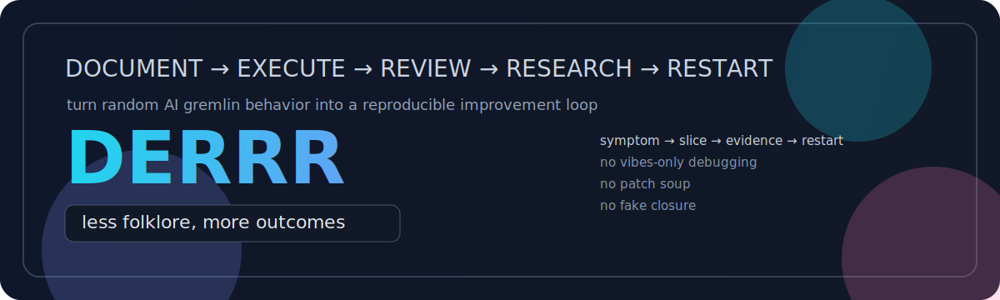

# DERRR

<p align="center">
  
</p>

<p align="center">
  <strong>DERRR, making your dumb agents smart 🤓</strong><br/>
  <em>A hypothesis-driven development and maintenance loop for agent systems and large codebases.</em>
</p>

<p align="center">
  <a href="./docs/derrr-formal-design.md">Formal design</a> ·
  <a href="./skill/">Skill</a> ·
  <a href="./examples/">Examples</a>
</p>

<p align="center">
  <code>v0.1</code>
  <code>method-first</code>
  <code>markdown-friendly</code>
  <code>plane-optional</code>
  <code>obsidian-optional</code>
  <code>less-wrong-maxxing</code>
  <code>MIT licensed</code>
</p>

<p align="center">
  
  
</p>

<p align="center">
  <strong>Turns chaotic agent development and maintenance into a reproducible loop with receipts.</strong>
</p>

<div align="center">

```text
┌──────────────────────────────────────────────────────────────┐
│ DERRR                                                        │
│ Document → Execute → Review → Research → Restart            │
│                                                              │
│ from "model did some weird nonsense again"                  │
│ to "we know what failed, where, and what to do next"        │
└──────────────────────────────────────────────────────────────┘
```

</div>

> [!TIP]
> **DERRR is for when the model is freelancing, the codebase is sprawling, the logs are a mess, and everyone is one more bad patch away from inventing a fake explanation.**

## Why people need this

Large codebases and agent systems are great at a few things, including:
- hiding one real bug behind six fake ones
- making every change feel connected to twelve other changes
- turning one weird model failure into three architecture arguments
- producing just enough success to keep bad development habits alive
- making teams say "maybe it's the prompt?" when the problem is actually the whole surrounding loop

DERRR exists to turn that random grab bag into something closer to a real development system:
- one active slice at a time
- one bounded move at a time
- direct review before more execution
- explicit restart points instead of wandering patch soup
- fewer haunted little mysteries per square foot

### The anti-magic pitch

If your current workflow is:
- vibes
- screenshots
- half-read logs
- one lucky prompt edit
- two accidental regressions
- a Slack message claiming it is fixed
- somebody muttering "we should probably refactor this later"

that is not a development system.
That is a campfire story with CI attached.

---

## Why DERRR exists

**DERRR is about turning messy agent behavior and large-codebase development into something you can actually observe, test, and improve on purpose.**

A lot of AI and agent work still runs on one-shot brilliance, lucky prompts, scattered logs, hand-wavy architecture decisions, and post-hoc storytelling.
That can feel impressive right up until the system regresses, contradicts itself, or fails in production and nobody can explain why.

DERRR exists to push that in a more scientific direction:
- deeper observability for otherwise black-box agent behavior
- evidence over vibes
- repeatable development loops instead of random heroic saves
- live chain context instead of isolated prompt snapshots or isolated code diffs
- narrow, auditable slices instead of speculative patch piles

In plain English, DERRR tries to turn "the model did something amazing once" and "the codebase mostly works if you don't look at it funny" into a repeatable research and improvement process.

A real example: DERRR helped avoid a wrong fix by narrowing a supposed audit hole into the more accurate question of **thin fallback artifacts with lost failure context**.

That is the bar here. Not tidy theory. Not framework cosplay. A way to make AI system improvement more evidence-based, more explainable, and a lot less hand-wavy.

### The promise

DERRR will not make hard systems easy.
It will make them easier to inspect, easier to discuss honestly, and harder to accidentally bullsh*t yourself about.

### The value, very directly

```text
random goblin sack of symptoms
        ↓
logs, artifacts, counters, and human hunches all start fistfighting
        ↓
DERRR forces one narrow question and one bounded move
        ↓
review says what actually changed
        ↓
next move comes from evidence, not caffeine improv
        ↓
system becomes less cursed, more legible, and slightly less stupid
```

### DERRR dashboard

```text
DEBUGGING STYLE        vibes goblin   →   evidence goblin with clipboard
WORK UNIT              screaming blob →   narrow slice
TEAM MEMORY            cave rumor     →   restart artifact
SYSTEM STATE           cursed raccoon →   legible raccoon
SUCCESS CRITERION      "seems fine?"  →   proved in review
```

---

## The loop

```text
Document -> Execute -> Review -> Research -> Restart
    ^                                            |
    |____________________________________________|

aka: stop guessing, do one thing, check it, learn something, begin again
```

### DERRR signal trace

```text
chaos     [########..]  symptoms everywhere, confidence nowhere
slice     [###.......]  one narrow question, finally
evidence  [######....]  logs, artifacts, measurements, comparisons
clarity   [########..]  wrong theories die here
restart   [#####.....]  next move becomes obvious
```

<table>
  <tr>
    <td><strong>D</strong>ocument</td>
    <td>Write down what you think is happening before you start flailing.</td>
  </tr>
  <tr>
    <td><strong>E</strong>xecute</td>
    <td>Do one narrow thing, not five "while we're in here" things.</td>
  </tr>
  <tr>
    <td><strong>R</strong>eview</td>
    <td>Check what actually happened, not what you hoped happened.</td>
  </tr>
  <tr>
    <td><strong>R</strong>esearch</td>
    <td>Trace the weirdness until the next real move becomes obvious.</td>
  </tr>
  <tr>
    <td><strong>R</strong>estart</td>
    <td>Close the slice cleanly and start the next one like an adult.</td>
  </tr>
</table>

### Core rule

> Do not execute before the active slice is recorded in the chosen control surface.
>
> In other words: no freestyling your way into fake confidence.

---

## Before / After

<table>
<tr>
<td width="50%" valign="top">

### Without DERRR

- weird failure shows up
- somebody says "maybe temperature?"
- somebody else says "maybe the parser"
- logs get sampled halfway
- two patches land together
- the model behaves for six minutes and everyone declares victory
- nobody knows what actually fixed it
- next regression gets treated like a brand new mystery

</td>
<td width="50%" valign="top">

### With DERRR

- active slice gets recorded first
- one narrow move gets executed
- review artifact says what proved, failed, or stayed weird
- research names the next real bottleneck
- restart closes the slice and opens the successor cleanly
- improvement becomes reproducible instead of anecdotal

</td>
</tr>
</table>

**Same messy system. Fewer cursed surprises, more repeatable wins.**

> [!NOTE]
> DERRR does not promise perfect models.
> It promises a better way to deal with models when they do weird, slippery, annoying model stuff.

## Start here

If you only remember three things, remember these:

1. **Record the active slice before you touch the system.**
2. **Change one narrow thing at a time.**
3. **Do not call it progress until the review artifact says what actually happened.**

## Choose your mode

<table>
  <tr>
    <th align="left">Mode</th>
    <th align="left">Best for</th>
    <th align="left">Start here</th>
  </tr>
  <tr>
    <td>📝 <strong>Markdown</strong></td>
    <td>solo work, low ceremony, repo-native notes</td>
    <td>use plain Markdown files and the templates in <a href="./skill/"><code>skill/</code></a></td>
  </tr>
  <tr>
    <td>🧠 <strong>Obsidian / Vault</strong></td>
    <td>people who already live in a note vault</td>
    <td>read the vault-oriented docs in the skill references</td>
  </tr>
  <tr>
    <td>📋 <strong>Plane Full</strong></td>
    <td>explicit lifecycle tracking, auditable slices, stronger control surface</td>
    <td>read <a href="./docs/derrr-formal-design.md"><code>docs/derrr-formal-design.md</code></a> and the Plane install notes</td>
  </tr>
  <tr>
    <td>🤖 <strong>Agent-facing skill</strong></td>
    <td>putting the method in front of an assistant instead of hoping it behaves</td>
    <td>open <a href="./skill/"><code>skill/</code></a></td>
  </tr>
</table>

### Quick start paths

- **I want the lightest version** → Use plain Markdown. No dashboard, no platform, no ceremony. Just notes, slices, and receipts.
- **I want the full method** → Read <a href="./docs/derrr-formal-design.md"><code>docs/derrr-formal-design.md</code></a>.
- **I want the practical agent-facing version** → Open <a href="./skill/"><code>skill/</code></a>.
- **I want proof this came from real use** → Read <a href="./examples/"><code>examples/</code></a>.
- **I want the short pitch** → DERRR is what you use when you want to stop treating AI behavior like magic and start treating it like an observable system.

---

## What DERRR is

DERRR is a control and investigation method for improving live agent systems when ad hoc iteration is too loose and tuning is premature.

### Failure patterns DERRR is meant to catch

```text
┌─ usual failure shape ─────────────────────────────────────────┐
│ weird behavior → guess → patch → partial relief → regress    │
│              ↘ missing evidence ↗                             │
└───────────────────────────────────────────────────────────────┘

┌─ DERRR shape ────────────────────────────────────────────────┐
│ weird behavior → narrow slice → execute → review → restart   │
│                         ↘ research when needed ↗             │
└──────────────────────────────────────────────────────────────┘
```

<table>
  <tr>
    <th align="left">Good fit</th>
    <th align="left">Bad fit</th>
  </tr>
  <tr>
    <td valign="top">
      - multi-step behavior failures<br/>
      - audit gaps<br/>
      - persistence mismatches<br/>
      - validator/coercion confusion<br/>
      - soak and review loops<br/>
      - repeated regressions
    </td>
    <td valign="top">
      - trivial one-file fixes<br/>
      - pure feature building with no live behavioral uncertainty<br/>
      - broad brainstorming with no active failure to narrow<br/>
      - tuning-first workflows<br/>
      - anything where you are mostly trying to look organized instead of actually learn something
    </td>
  </tr>
</table>

---

## Control surfaces

DERRR is **method-first, not tool-first**.

That means you do **not** need any special platform to use it.
Markdown-only use is completely valid.

> [!IMPORTANT]
> Plane is supported, not required.
> Obsidian is supported, not required.
> Markdown-only is a first-class path, not the cheap version.

### Supported modes

- **Markdown**  
  Plain `.md` files in a repo or working folder.

- **Obsidian**  
  A Markdown note-taking app built around local note vaults. Useful if you already work that way.

- **Plane**  
  An issue-tracking and project-management tool. Useful if you want explicit lifecycle state, issue history, and a stronger audit trail.

### Important

- **Plane is optional**
- **Obsidian is optional**
- **Markdown-only is a first-class way to use DERRR**

### Optional tool setup links

- Obsidian docs: <https://help.obsidian.md/>
- Plane app: <https://plane.so/>
- Plane API/docs: <https://developers.plane.so/api-reference/introduction>

### If you want to use Plane

1. install or access Plane
2. create a workspace and project
3. create an API key
4. use Plane as the source of truth for active slices and lifecycle state

### If you want to use Obsidian

1. install Obsidian
2. create or open a vault
3. store DERRR notes and templates inside that vault

---

## Repo map

| Path | What it is |
| --- | --- |
| [`docs/derrr-formal-design.md`](./docs/derrr-formal-design.md) | the full method |
| [`skill/`](./skill/) | the practical agent-facing version |
| [`examples/`](./examples/) | worked example material from a real loop |
| [`dist/`](./dist/) | packaged skill artifacts |
| [`README.md`](./README.md) | the fast pitch for humans who want the point before the theory |

### Recommended reading order

- **Just tell me what this is** → stay in this README
- **I want the deeper method** → read `docs/derrr-formal-design.md`
- **I want to use it with an assistant** → open `skill/`
- **I want to see real field mileage** → open `examples/`

---

## Current maturity

> [!NOTE]
> **Status: v0.1**
>
> Real enough to use, early enough to still have a little duct tape showing.

That means:
- the method is real
- the first skill draft is usable
- the loop has at least one real-world validation
- the project is intentionally lean
- rough edges are expected

### Translation

This is not a giant polished platform.
It is a sharp working method with real field mileage, now being turned into a proper public artifact.

---

## Why this feels different

Most process docs try to make work look tidy.
DERRR is trying to make the investigation itself less wrong.

That means it biases toward:
- narrow slices over broad plans
- proof over confidence
- explicit closure over implied completion
- restart points over wandering continuity
- tool optionality over tool dependence

## What happens next

Use the first draft skill on additional real loops and tighten the method only where observed misuse, drift, or confusion actually justifies it.

---

## Credibility, sources, and credit

DERRR was not invented in a vacuum. It is a practical synthesis shaped by real live-loop work and by adjacent ideas from:
- observability and tracing culture in software/systems engineering
- scientific debugging and hypothesis-driven investigation
- issue-driven operational workflows
- evidence-first evaluation habits from ML and AI systems work

This repo's specific DERRR framing, wording, templates, and operating loop were developed in the course of real work by Christian Penrod with agent assistance.

### External tools and docs referenced in the repo

- Obsidian docs: <https://help.obsidian.md/>
- Plane app: <https://plane.so/>
- Plane API/docs: <https://developers.plane.so/api-reference/introduction>

If this repo becomes more useful over time, those references should probably grow into a more explicit acknowledgments section rather than pretending the project emerged from pure mountain-cave revelation.

---

## License

This project is licensed under the **MIT License**.
See [`LICENSE`](./LICENSE).

---

## Support

If DERRR helps you make an AI system less wrong, a star on the repo is appreciated.

If you want to support the work directly:
- Buy Me a Coffee: <https://buymeacoffee.com/zero.hash>

---

## DERRR in one screen

```text
symptom appears
      ↓
record active slice
      ↓
make one narrow move
      ↓
review real evidence
      ↓
name what proved / failed / stayed weird
      ↓
research only if the next move is still unclear
      ↓
close cleanly, open successor, restart
```

---

## Motto

> DERRR should make you more disciplined, but more importantly, it should make you **less wrong**.
>
> If it ever becomes more pompous than useful, the method has failed the vibe check.

```text
less guessing
more tracing
less patch soup
more evidence
less magic
more system
```
